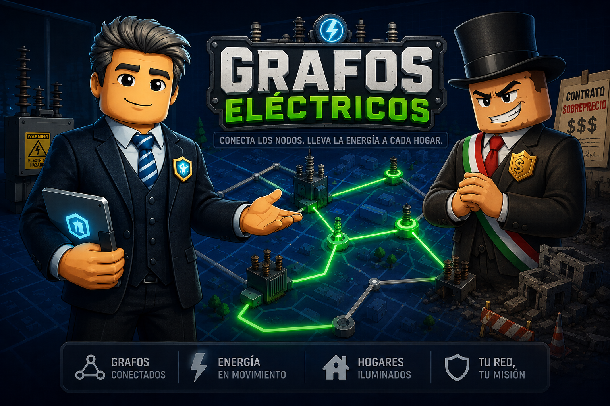

# EDA GRAFOS

> Un videojuego educativo en Roblox donde aprendes teoría de grafos mientras desenmascaras la corrupción del Alcalde de Villa Conexa.

[](https://www.roblox.com/es/games/75898735178917/EDA-GRAFOS)

## 🎮 ¿De qué trata?

**Grafos Electricos** es una experiencia de aprendizaje interactiva que combina **estructuras de datos y algoritmos** con una narrativa de misterio y aventura. El jugador asume el rol de **Tocino**, un aprendiz de electricista contratado por la empresa **Redes y Caminos**, dirigida por el ingeniero **Carlos**.





La ciudad de **Villa Conexa** sufre constantes apagones y emergencias eléctricas. El **Alcalde** asegura que todo es sabotaje y que su plan de modernización es impecable, pero Carlos sospecha que los contratos públicos están inflados con cables innecesarios, conexiones redundantes y nodos sobrecargados.

Tu misión: **auditar la red eléctrica usando algoritmos de grafos**, reparar las zonas afectadas y reunir pruebas para confrontar al Alcalde en una rueda de prensa final. 

## 🧠 Conceptos y algoritmos que se practican

| Nivel | Tema | Algoritmo / Concepto |
|-------|------|----------------------|
| **Nivel 0 — Laboratorio de Grafos** | Fundamentos | Nodos, aristas, adyacencia, grado, grafos dirigidos, conectividad |
| **Nivel 1 — El Barrio Antiguo** | Búsqueda y conectividad | BFS y DFS |
| **Nivel 2 — La Ruta Más Corta** | Caminos de menor costo | Dijkstra |
| **Nivel 3 — El Árbol de Expansión Mínima** | Redes eficientes sin desperdicio | Prim y MST |

## 🕹️ Mecánicas principales

- **Conexión de cables:** crea aristas entre nodos para restaurar el flujo de energía.
- **Panel de análisis:** ejecuta BFS, DFS, Dijkstra o Prim sobre el grafo en 3D.
- **Reparación de nodos:** corrige postes y subestaciones dañados por sobrecargas.
- **Emergencias eléctricas:** completa objetivos contra el tiempo.
- **Diálogos narrativos:** interactúa con Carlos, el Alcalde, ciudadanos, reporteros y oficiales.
- **Rueda de prensa final:** responde correctamente para desenmascarar al Alcalde o ser denunciado por calumnia.

## 🏙️ Historia y personajes

- **Tocino:** el protagonista, aprendiz de electricista.
- **Carlos:** ingeniero experto en redes, guía y mentor del jugador.
- **Alcalde:** antagonista que defiende sus obras con excusas y evasivas.
- **Ciudadanos, Reportero y Oficial:** personajes que reaccionan a las pruebas presentadas.

## 🚀 Jugar ahora

Haz clic en el siguiente enlace para jugar directamente en Roblox:

**👉 [https://www.roblox.com/es/games/75898735178917/EDA-GRAFOS](https://www.roblox.com/es/games/75898735178917/EDA-GRAFOS)**

## Video Tutorial

**https://youtu.be/L6jPDT7cDn4**

## 🛠️ Tecnología

- **Motor:** Roblox Studio
- **Lenguaje:** Luau (Roblox Lua)
- **Arquitectura:** cliente/servidor con sistemas modulares para diálogos, HUD, efectos, puntuación y progresión de niveles.

## 📁 Estructura del repositorio

```
GrafosV3/
├── ReplicatedStorage/
│   ├── Config/         # Configuración de niveles (LevelsConfig.lua)
│   ├── DialogoData/    # Diálogos por nivel
│   ├── Efectos/        # Sistema de efectos visuales
│   └── Compartido/     # Utilidades y servicios compartidos
├── ServerScriptService/# Lógica del servidor
├── StarterPlayerScripts/ # Lógica del cliente (HUD, diálogos, gameplay)
└── Documentos/         # Documentación de diseño
```

## 📜 Licencia

Proyecto académico / educativo. Todos los derechos reservados por sus autores.

---

*Aprende grafos, salva la ciudad y demuestra que los algoritmos pueden derrotar la corrupción.*
